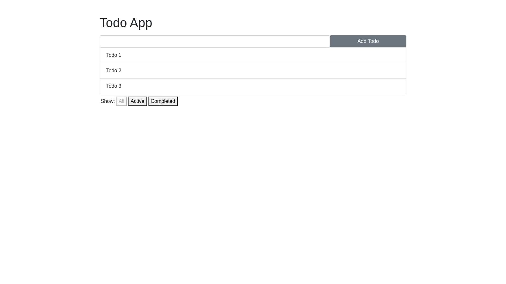

# Todo App with React Redux
- New items can be added by filling textbox at the top and pressing the "Add Todo" button
- To mark an item as completed, you can simply click on that item
- To unmark an item, you can click on that item second time
- By clicking active button, you can only see the uncompleted items the list
- By clicking completed button, you can only see completed items in the list

